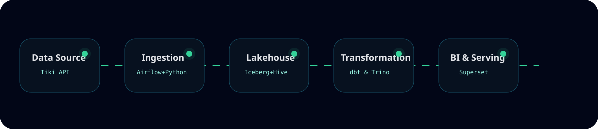
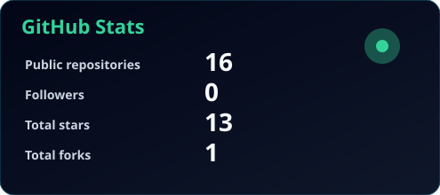
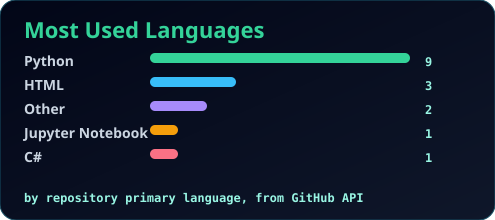
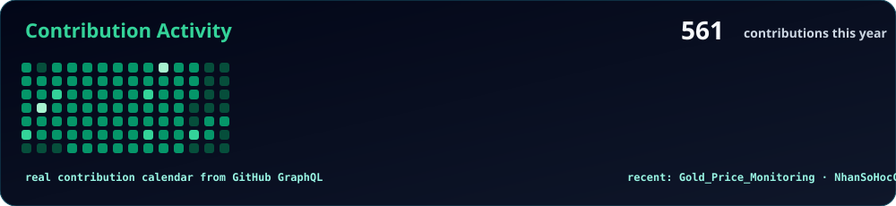

<div align="center">
  
</div>

<div align="center">

[](#)
[](https://github.com/Ancuyou/Website-QAUTE)
[](#)

</div>

## About me

I am a final-year **Information Technology student at HCMC University of Technology and Engineering (HCMUTE)**

My core passion lies in designing automated data processing pipelines (ETL/ELT), building Data Warehouse/Lakehouse architectures, and developing robust Backend systems.

Currently, I am looking for a **Internship/Fresher** opportunity as a **Data Engineer**.

<div align="center">
  
</div>

## What I build

<table>
<tr>
<td width="50%" valign="top">

### Data Engineering & Analytics

I work on Lakehouse architectures, data pipeline automation, and Data Warehouse construction.

- [`Tiki Data Lakehouse`](https://github.com/NhanSoHocCode/tiki-ecommerce-data-lakehouse) — Automated ETL/ELT pipeline crawling daily e-commerce data to build a robust Lakehouse architecture (Iceberg/Trino) for Superset dashboards.
- [`DW_Olist`](#) — End-to-end Data Warehouse for Brazilian E-commerce built with SQL Server, SSIS, SSAS, Power BI.

</td>
<td width="50%" valign="top">

### Backend Systems & Databases

I like building management systems, complex business data flow processing, APIs, and relational databases.

- [`Website-QAUTE`](https://github.com/Ancuyou/Website-QAUTE) — Full-stack consulting platform built with Spring Boot, highlighting multi-role authorization, real-time WebSocket messaging, and AI-driven support.
- [`user-management-oracle`](https://github.com/NhanSoHocCode/user-management-oracle) — Database security & user management system leveraging Oracle VPD, OLS, and Spring Security for multi-layered data protection.

</td>
</tr>
<tr>
<td width="50%" valign="top">

### Applied AI & IoT

I am interested in applied AI algorithms, multi-threading processing, and real-time recognition.

- [`Facial-recognition-system`](https://github.com/NhanSoHocCode/Facial-recognition-system) — Facial recognition software integrated with anti-spoofing

</td>
<td width="50%" valign="top">

### Infrastructure & Data-minded engineering

I care about the foundations that make systems scalable: automated ETL/ELT pipelines, robust data lakehouse architectures.

- Python, SQL, Bash scripting
- Apache Spark, Hadoop, Apache Iceberg, Trino, dbt, Hive
- Apache Airflow, PySpark, Apache Superset
- PostgreSQL, MySQL, MS SQL Server, Oracle Database, MinIO, HDFS
- Linux, Docker, GitHub Actions

</td>
</tr>
</table>

## Selected repositories

| Repository | What it is | Stack / direction |
| --- | --- | --- |
| [`Tiki Data Lakehouse`](https://github.com/NhanSoHocCode/tiki-ecommerce-data-lakehouse) | End-to-end E-commerce data pipeline (crawl, store, transform, visualize) | Python, MinIO, Trino, Iceberg, dbt, Airflow, Superset |
| [`Data Warehouse Olist`](#) | Data Warehouse construction and automated ETL flow | MS SQL Server, SSIS |
| [`Website-QAUTE`](https://github.com/Ancuyou/Website-QAUTE) | Student consulting platform with real-time chat, AI integration, and events | Java 21, Spring Boot, MySQL, WebSocket, Thymeleaf |
| [`User Management Oracle`](https://github.com/NhanSoHocCode/user-management-oracle) | Oracle user management web app using 3-tier architecture & Passive MVP | Java, Spring Boot, Oracle Database, PL/SQL |
| [`Facial Recognition`](https://github.com/NhanSoHocCode/Facial-recognition-system) | Facial recognition software integrated with anti-spoofing | Python, ResNet, OpenCV, ESP32, C++ |

## Current deep build: Tiki Data Lakehouse

<div align="center">
  
</div>

```text
[ Data Source ]
   Tiki API (Dữ liệu sản phẩm, category, rating)
        |
        v
   -> [ Orchestration & Ingestion ]
        Apache Airflow điều phối Python Crawler -> Lưu raw data dạng Parquet vào MinIO
             |
             v
             -> [ Lakehouse Storage ]
                  Quản lý bảng bằng Apache Iceberg & Expose raw data qua Hive Catalog
                       |
                       v
                       -> [ Transformation ]
                            Sử dụng dbt chạy qua Trino engine để build Staging, Dimensions & Facts
                                 |
                                 v
                                 -> [ Data Serving & BI ]
                                      Truy vấn SQL tốc độ cao qua Trino & Trực quan hóa trên Apache Superset
```

## Toolbox

```text
Data Flow    Apache Airflow, dbt, Apache Spark, Trino, Hadoop, PySpark
Languages    Python, SQL, Bash scripting
Infra        Linux, Docker, GitHub, GitHub Actions
Databases    PostgreSQL, MySQL, SQL Server, Oracle Database, MinIO, HDFS, Hive
```

## GitHub stats from real data

These cards are generated from the GitHub API by a scheduled GitHub Action, then rendered as local SVG files. They are not fake numbers and they do not depend on third-party stat image services.

<div align="center">
  
  
  <br />
  <br />
  
</div>

## Build philosophy

> I believe that the true value of data is only unlocked when it is built on a solid infrastructure foundation. My direction is to combine the optimization mindset of Backend engineering with modern data architectures, flexibly applying intelligent technologies (AI) to transform raw data into information that brings practical value.

I am still a student, but I want my projects to look and feel like serious engineering work: readable architecture, runnable commands, useful abstractions, clean docs, and enough polish that another engineer can understand the system without asking me to explain every file.
